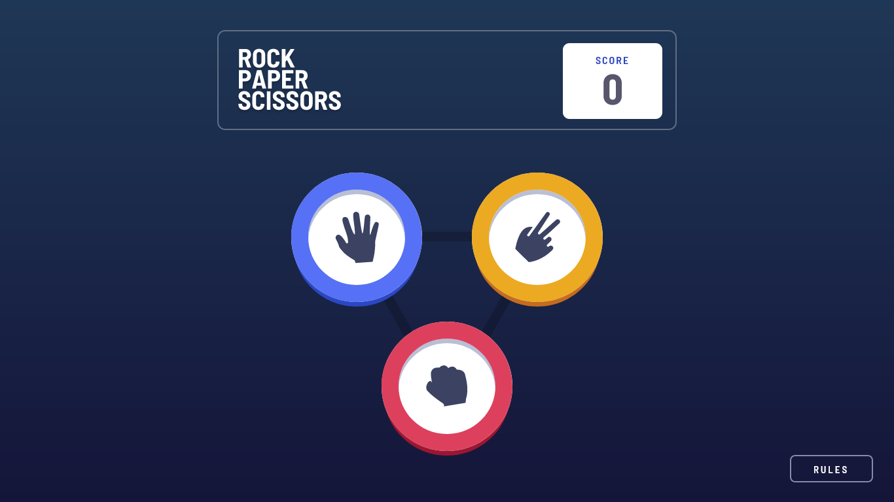

# Frontend Mentor - Rock, Paper, Scissors solution

This is a solution to the [Rock, Paper, Scissors challenge on Frontend Mentor](https://www.frontendmentor.io/challenges/rock-paper-scissors-game-pTgwgvgH). Frontend Mentor challenges help you improve your coding skills by building realistic projects. 

## Table of contents

- [Overview](#overview)
  - [The challenge](#the-challenge)
  - [Screenshot](#screenshot)
  - [Links](#links)
- [My process](#my-process)
  - [Built with](#built-with)
- [Author](#author)

## Overview

### The challenge

Users should be able to:

- View the optimal layout for the game depending on their device's screen size
- Play Rock, Paper, Scissors against the computer
- Maintain the state of the score after refreshing the browser _(optional)_
- **Bonus**: Play Rock, Paper, Scissors, Lizard, Spock against the computer _(optional)_

### Screenshot

### Links

- Solution URL: [https://github.com/keeplearning211/fe-mentor_rock-paper-scissors](https://github.com/keeplearning211/fe-mentor_rock-paper-scissors)
- Live Site URL: [https://rock-paper-scissors-zeta-puce.vercel.app/](https://rock-paper-scissors-zeta-puce.vercel.app/)

## My process

### Built with

- [React](https://reactjs.org/) - JS library for building user interfaces
- [NextJs](https://nextjs.org/) - All the tools you need to make the Web. Faster.
- [Redux toolkit](https://redux-toolkit.js.org/) - The official, opinionated, batteries-included toolset for efficient Redux development.
- [TypeScript](https://www.typescriptlang.org/) - A superset of JavaScript that adds static types.

## Author

- Frontend Mentor - [keeplearning211](https://www.frontendmentor.io/profile/keeplearning211)
